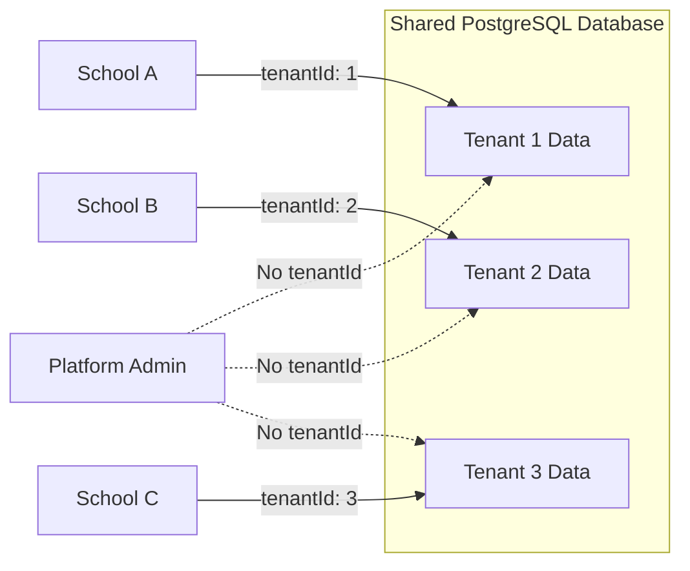

# Multi-Tenant Model

> How CloudSchool achieves tenant isolation in a shared database.

## Multi-Tenant Architecture



## Tenant Isolation Strategy

### Row-Level Security
Every business entity includes a `tenantId` foreign key:
- Students, Classes, Subjects, Scores, Promotions
- Users, ActivityLogs, Fees, TeacherAssignments
- TransferHistories, ClassEnrollments

### TenantGuard Middleware
```javascript
// backend/src/middleware/auth.js
const tenantGuard = (req, res, next) => {
  if (req.user.role === 'PLATFORM_ADMIN') return next()
  if (!req.tenantId) {
    return next(new AppError('Tenant context required', 403, 'NO_TENANT'))
  }
  next()
}
```

**Behavior**:
- Platform Admin: bypasses tenant scoping (cross-tenant queries)
- All other roles: must have `tenantId`, queries scoped to tenant

### Tenant Context Injection
After authentication, `req.tenantId` is automatically set from user's tenant affiliation:
```javascript
req.tenantId = user.tenantId
```

All route handlers use `req.tenantId` in Prisma queries:
```javascript
const students = await prisma.student.findMany({
  where: { tenantId: req.tenantId }
})
```

## Tenant Entity

```prisma
model Tenant {
  id          String       @id @default(uuid())
  name        String       // School name
  code        String       @unique  // Login code (e.g., "THPT-DEMO")
  status      TenantStatus @default(ACTIVE)  // ACTIVE | SUSPENDED | INACTIVE
  planId      String?      // FK → SubscriptionPlan
  // Relations
  users             User[]
  students          Student[]
  classes           Class[]
  // ... 15+ more relations
}
```

## Tenant Settings

Each tenant has configurable settings:
```prisma
model TenantSettings {
  tenantId     String  @unique FK → Tenant
  minAge       Int     @default(15)   // QD1
  maxAge       Int     @default(20)   // QD1
  maxClassSize Int     @default(40)   // QD2
  passScore    Float   @default(5.0)  // QD5
  // ... more settings
}
```

**Cached**: LRU cache (100 entries, 5min TTL) for performance.

## Subscription Plans

Tenants are associated with subscription plans that define limits:
```prisma
model SubscriptionPlan {
  id           String   @id
  name         String   @unique  // "Cơ bản", "Nâng cao"
  studentLimit Int      @default(100)
  teacherLimit Int      @default(20)
  classLimit   Int      @default(30)
  features     String[] // Feature flags
  isActive     Boolean  @default(true)
}
```

## Tenant Lifecycle

1. **Registration**: School self-registers via `/register`
2. **Creation**: Creates Tenant + TenantSettings + default Grades + SUPER_ADMIN user
3. **Active**: Tenant operates normally (ACTIVE status)
4. **Suspend**: Platform Admin can suspend (SUSPENDED status, users can't login)
5. **Delete**: Platform Admin can delete (removes all associated data via Cascade)

## Security Considerations

- **Cross-tenant queries prevented**: Every query includes `tenantId` filter
- **Cascade deletes**: Deleting a tenant removes all associated data
- **Settings isolation**: Each tenant has independent settings
- **Code uniqueness**: Tenant `code` is unique across all tenants

## Related
- [Architecture Overview](overview.md)
- [Tenant Isolation Security](../security/tenant-isolation.md)
- [Login Flows](../authentication/login-flows.md)
