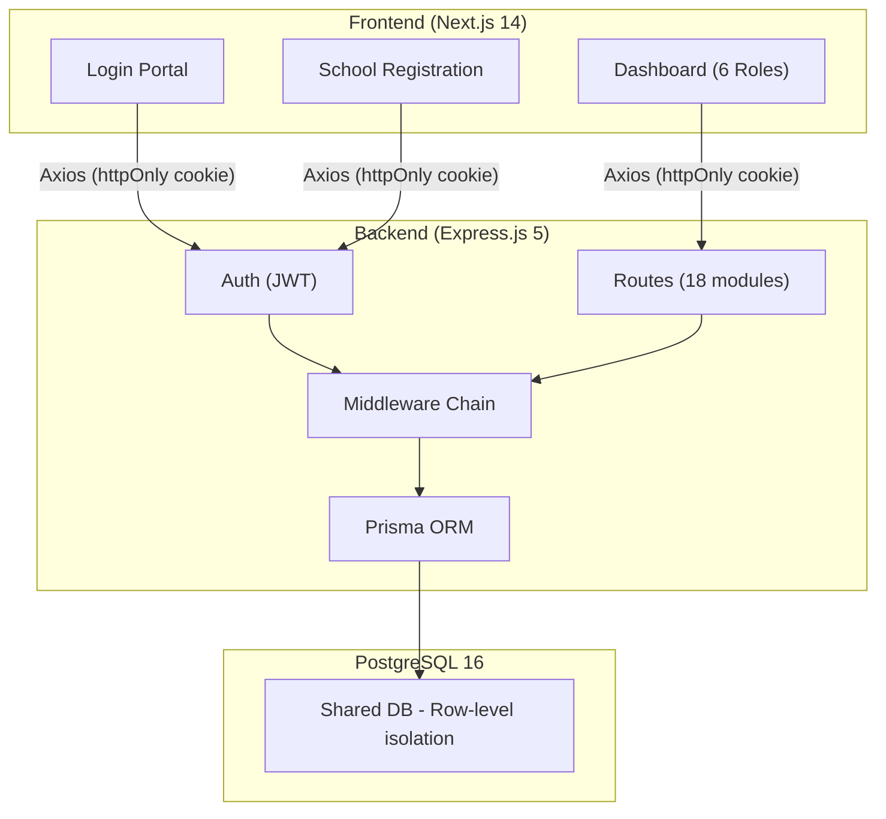

# Architecture Overview

> CloudSchool's multi-tenant SaaS architecture.

## System Architecture

## Component Layers

| Layer | Technology | Purpose |
|-------|------------|---------|
| **Frontend** | Next.js 14, React, TypeScript, Tailwind CSS | UI, routing, state management |
| **API Client** | Axios with interceptors | HTTP requests, error handling, 401 redirect |
| **State Management** | Zustand + sessionStorage | Auth state, user info, tenant context |
| **Backend API** | Express.js 5, Prisma ORM | REST API, business logic, data access |
| **Authentication** | JWT + bcryptjs + cookie-parser | Token-based auth, httpOnly cookies |
| **Database** | PostgreSQL 16 | Shared database with tenant isolation |
| **DevOps** | Docker, Docker Compose | Container orchestration |

## Key Architectural Decisions

### Shared Database, Row-Level Isolation
- All tenants share one PostgreSQL database
- Every row includes `tenantId` foreign key
- Middleware automatically injects tenant context into queries
- Platform Admin bypasses tenant scoping

### JWT Cookie-Based Authentication
- Tokens stored in httpOnly, SameSite=Lax cookies
- Browser auto-sends cookies with requests
- No XSS vulnerability from localStorage token access
- 24-hour token expiry

### Role-Based Access Control
- 6 distinct roles with different permissions
- Middleware chain: authenticate → authorize → tenantGuard
- UI dynamically shows/hides features based on role

## Related
- [Multi-Tenant Model](multi-tenant-model.md)
- [Technology Stack](tech-stack.md)
- [Authentication Overview](../authentication/overview.md)
