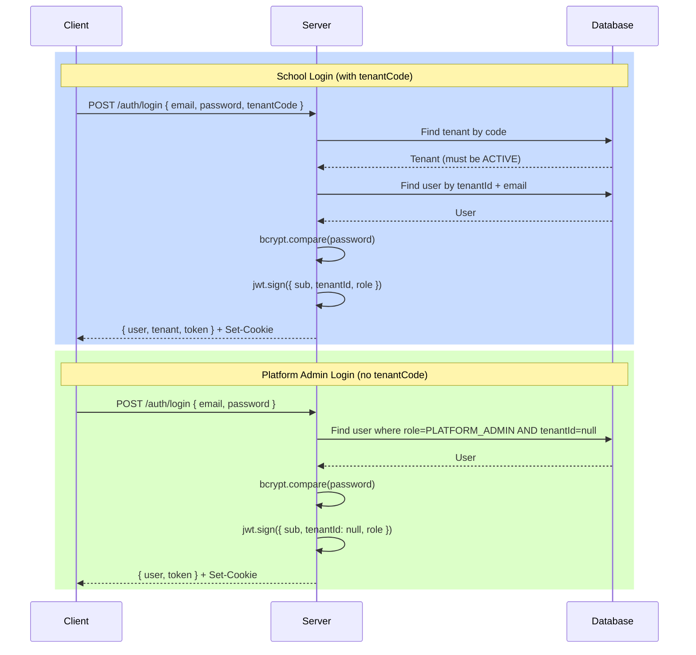

# Login Flows

Authentication endpoints for school users and platform admins.

## Login Flow Comparison



## School Login

**`POST /auth/login`** with `tenantCode`:

| Field        | Required | Description                    |
|--------------|----------|--------------------------------|
| `email`      | ✅       | User email address             |
| `password`   | ✅       | Plain-text password            |
| `tenantCode` | ✅       | School code (case-insensitive) |

**Response includes:** `user`, `tenant` (id, name, code), `token`.

**Parent special case:** When role is `PARENT`, response includes `children` array:

```json
{
  "data": {
    "user": { "id": "...", "email": "...", "role": "PARENT" },
    "tenant": { "id": "...", "name": "ABC School", "code": "ABC123" },
    "children": [
      { "id": "...", "fullName": "Nguyen Van A", "studentCode": "S001", "className": "10A1", "relationship": "father" }
    ],
    "token": "eyJ..."
  }
}
```

## Platform Admin Login

**`POST /auth/login`** without `tenantCode`:

| Field      | Required | Description          |
|------------|----------|----------------------|
| `email`    | ✅       | Admin email          |
| `password` | ✅       | Admin password       |

Lookup: `User.findFirst({ where: { email, role: 'PLATFORM_ADMIN', tenantId: null } })`

Response includes `user` and `token` only (no `tenant` or `children`).

## School Registration

**`POST /auth/register-school`** — public endpoint, auto-creates tenant + admin:

| Field          | Required | Description                          |
|----------------|----------|--------------------------------------|
| `schoolName`   | ✅       | School name (1-100 chars)            |
| `email`        | ✅       | Admin email                          |
| `password`     | ✅       | Admin password (min 6 chars)         |
| `adminName`    | ❌       | Defaults to `"Admin - {schoolName}"` |
| `phone`        | ❌       | School phone number                  |
| `address`      | ❌       | School address                       |
| `planId`       | ❌       | Subscription plan ID                 |

**Auto-generated:**
- Tenant code: `{schoolName alphanumeric (max 8)}{3 random chars}` → e.g., `ABCDEFX7K`
- Default grades: Khối 10, Khối 11, Khối 12
- Default tenant settings (minAge: 15, maxAge: 20, maxClassSize: 40)
- Admin user with `SUPER_ADMIN` role

## Rate Limiting

| Endpoint           | Limit      | Window   | Bypass Token      |
|--------------------|------------|----------|-------------------|
| `POST /auth/login` | 50 requests| 15 min   | `x-ratelimit-bypass` header |
| `POST /register-school` | 20 requests | 1 hour | `x-ratelimit-bypass` header |

Bypass secret: `process.env.RATE_LIMIT_BYPASS_SECRET` (used for Playwright E2E tests).

## Related

- [Authentication Overview](overview.md) — JWT token mechanics
- [Roles & Permissions](roles-permissions.md) — 6-role permission matrix
- [Middleware Chain](middleware-chain.md) — authenticate middleware
- [`backend/src/routes/auth.routes.js`](../../../backend/src/routes/auth.routes.js) — route definitions
