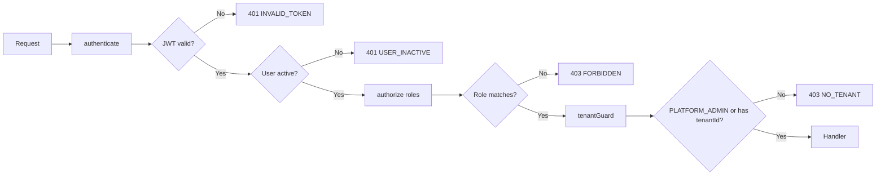

# Auth Middleware Chain

Three middleware functions compose the authentication pipeline.

## Middleware Flow



## 1. `authenticate`

Validates identity and attaches `req.user` + `req.tenantId`.

**Steps:**
1. Extract token from `req.cookies.token` or `Authorization: Bearer <token>`
2. `jwt.verify(token, JWT_SECRET)` — decodes `{ sub, tenantId, role }`
3. **LRU cache lookup** — `userCache` (500 entries, 60s TTL)
4. Cache miss → `prisma.user.findUnique({ where: { id }, include: { tenant } })`
5. Cache the result; reject if user inactive
6. Attach `req.user` and `req.tenantId`
7. Fetch tenant settings from `settingsCache` (100 entries, 5min TTL) or DB
8. Attach `req.tenantSettings` for non-platform-admin users

**Cache configuration:**

| Cache         | Max Entries | TTL    | Key        |
|---------------|-------------|--------|------------|
| `userCache`   | 500         | 60s    | `userId`   |
| `settingsCache`| 100        | 5min   | `tenantId` |

## 2. `authorize(...roles)`

Factory function returning role-check middleware:

```js
// backend/src/middleware/auth.js
const authorize = (...roles) => (req, res, next) => {
  if (!roles.includes(req.user.role)) {
    return next(new AppError('Insufficient permissions', 403, 'FORBIDDEN'))
  }
  next()
}
```

**Usage:**
```js
router.delete('/users/:id', authenticate, authorize('SUPER_ADMIN', 'STAFF'), handler)
```

## 3. `tenantGuard`

Enforces tenant isolation for multi-tenant data access:

- `PLATFORM_ADMIN` → bypassed (cross-tenant access)
- All other roles → requires `req.tenantId`; returns `403 NO_TENANT` if absent

## Cache Invalidation

```js
invalidateUserCache(userId)       // Call after user update/delete
invalidateSettingsCache(tenantId) // Call after tenant settings change
```

## Typical Route Composition

```js
// Platform admin route (bypasses tenantGuard)
router.get('/tenants', authenticate, authorize('PLATFORM_ADMIN'), listTenants)

// Tenant-scoped route (full chain)
router.get('/users', authenticate, authorize('SUPER_ADMIN', 'STAFF'), tenantGuard, listUsers)
```

## Related

- [Authentication Overview](overview.md) — JWT token generation
- [Roles & Permissions](roles-permissions.md) — 6-role permission matrix
- [Login Flows](login-flows.md) — login endpoints
- [`backend/src/middleware/auth.js`](../../../backend/src/middleware/auth.js) — full implementation
