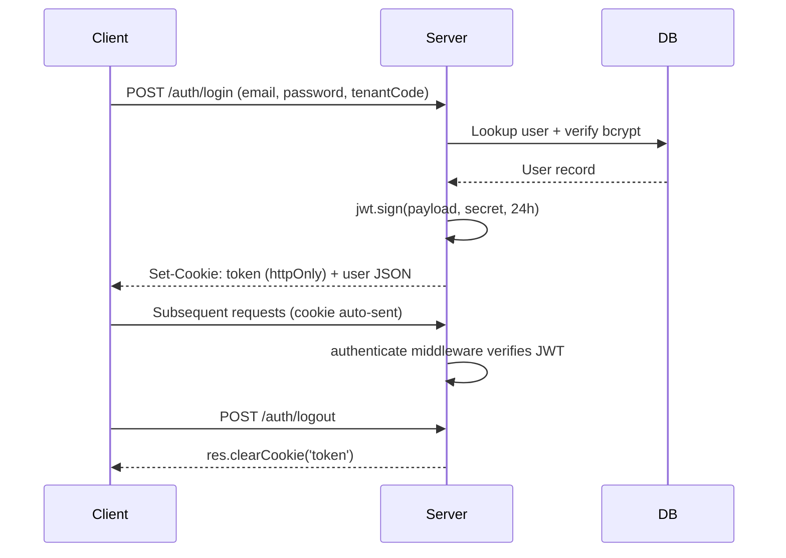

# Authentication Overview

JWT cookie-based authentication for multi-tenant school management platform.

## Token Generation

Tokens are generated via `jwt.sign()` with a standardized payload:

```js
// backend/src/routes/auth.routes.js
jwt.sign(
  { sub: user.id, tenantId: user.tenantId, role: user.role },
  process.env.JWT_SECRET,
  { expiresIn: process.env.JWT_EXPIRES_IN || '24h' }
)
```

| Claim     | Description                          |
|-----------|--------------------------------------|
| `sub`     | User UUID                            |
| `tenantId`| Tenant UUID (`null` for platform admin) |
| `role`    | One of 6 roles (see [Roles & Permissions](roles-permissions.md)) |

## Token Storage

Cookies are set with security-focused attributes:

```js
// backend/src/routes/auth.routes.js
res.cookie('token', token, {
  httpOnly: true,
  secure: process.env.COOKIE_SECURE === 'true',
  sameSite: 'lax',
  maxAge: 24 * 60 * 60 * 1000  // 24 hours
})
```

| Attribute     | Value                              | Purpose                    |
|---------------|------------------------------------|----------------------------|
| `httpOnly`    | `true`                             | Prevents XSS cookie access |
| `secure`      | `true` in production               | HTTPS-only transmission    |
| `sameSite`    | `lax`                              | CSRF mitigation            |
| `maxAge`      | `86400000` (24h)                   | Session lifetime           |

## Token Lifecycle



## Token Transmission

Tokens are accepted from two sources, checked in order:

1. `req.cookies.token` — cookie-based (primary, browser clients)
2. `Authorization: Bearer <token>` — header-based (API/mobile clients)

## Related

- [Roles & Permissions](roles-permissions.md) — 6-role permission matrix
- [Middleware Chain](middleware-chain.md) — authenticate → authorize → tenantGuard
- [Login Flows](login-flows.md) — login, registration, logout endpoints
- [`backend/src/routes/auth.routes.js`](../../../backend/src/routes/auth.routes.js) — route definitions
- [`backend/src/middleware/auth.js`](../../../backend/src/middleware/auth.js) — middleware implementation
