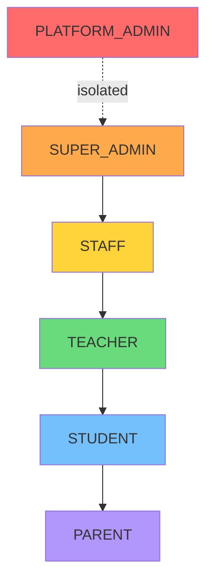

# Roles & Permissions

6-role RBAC system with endpoint-level authorization.

## Role Hierarchy

| Role            | Scope        | Description                        |
|-----------------|--------------|------------------------------------|
| `PLATFORM_ADMIN`| All tenants  | SaaS platform operator             |
| `SUPER_ADMIN`   | Single tenant| School owner/principal             |
| `STAFF`         | Single tenant| Administrative staff               |
| `TEACHER`       | Single tenant| Teaching staff                     |
| `STUDENT`       | Single tenant| Enrolled student                   |
| `PARENT`        | Single tenant| Parent/guardian of student(s)      |

## Endpoint Access Matrix

| Endpoint Group         | PLATFORM_ADMIN | SUPER_ADMIN | STAFF | TEACHER | STUDENT | PARENT |
|------------------------|:--------------:|:-----------:|:-----:|:-------:|:-------:|:------:|
| `/auth/*`              | ✅             | ✅          | ✅    | ✅      | ✅      | ✅     |
| `/users` (CRUD)        | ✅             | ✅          | ✅ R  | ❌      | ❌      | ❌     |
| `/classes` (CRUD)      | ✅             | ✅          | ✅    | ✅ R    | ✅ R    | ❌     |
| `/subjects` (CRUD)     | ✅             | ✅          | ✅    | ✅ R    | ✅ R    | ❌     |
| `/exams` (CRUD)        | ✅             | ✅          | ✅    | ✅ R/W  | ✅ R    | ✅ R   |
| `/scores` (CRUD)       | ✅             | ✅          | ✅    | ✅ R/W  | ✅ R    | ✅ R   |
| `/timetables` (CRUD)   | ✅             | ✅          | ✅    | ✅ R    | ✅ R    | ❌     |
| `/assignments` (CRUD)  | ✅             | ✅          | ✅    | ✅ R/W  | ✅ R/W  | ❌     |
| `/study-units` (CRUD)  | ✅             | ✅          | ✅    | ✅      | ❌      | ❌     |
| `/tenants` (CRUD)      | ✅             | ❌          | ❌    | ❌      | ❌      | ❌     |
| `/subscription-plans`  | ✅             | ❌          | ❌    | ❌      | ❌      | ❌     |
| `/tenants/:id/scores`  | ❌             | ✅          | ✅    | ❌      | ❌      | ❌     |

✅ = Full CRUD | ✅ R = Read only | ✅ R/W = Read + Write | ❌ = No access

## UI Menu Visibility

| Menu Item        | PLATFORM_ADMIN | SUPER_ADMIN | STAFF | TEACHER | STUDENT | PARENT |
|------------------|:--------------:|:-----------:|:-----:|:-------:|:-------:|:------:|
| Dashboard        | ✅             | ✅          | ✅    | ✅      | ✅      | ✅     |
| Users            | ✅             | ✅          | ✅    | ❌      | ❌      | ❌     |
| Classes          | ✅             | ✅          | ✅    | ✅      | ✅      | ❌     |
| Exams & Scores   | ✅             | ✅          | ✅    | ✅      | ✅      | ✅     |
| Timetables       | ✅             | ✅          | ✅    | ✅      | ✅      | ❌     |
| Assignments      | ✅             | ✅          | ✅    | ✅      | ✅      | ❌     |
| Study Units      | ✅             | ✅          | ✅    | ✅      | ❌      | ❌     |
| Tenants          | ✅             | ❌          | ❌    | ❌      | ❌      | ❌     |
| Subscription     | ✅             | ❌          | ❌    | ❌      | ❌      | ❌     |

## Role Escalation Prevention

The `PUT /users/:id` endpoint enforces strict role assignment:

- Only `SUPER_ADMIN`, `STAFF`, and `TEACHER` roles can be assigned via user update
- `PLATFORM_ADMIN` and `STUDENT` roles cannot be assigned through the user PUT endpoint
- Role changes are validated server-side regardless of client-supplied payload

Implementation: [`backend/src/middleware/auth.js`](../../../backend/src/middleware/auth.js) — `authorize(...roles)` function checks `req.user.role` against a whitelist before proceeding.

## Related

- [Authentication Overview](overview.md) — JWT token mechanics
- [Middleware Chain](middleware-chain.md) — authorize middleware implementation
- [Login Flows](login-flows.md) — role-specific login responses
- [`backend/src/middleware/auth.js`](../../../backend/src/middleware/auth.js) — authorize function
