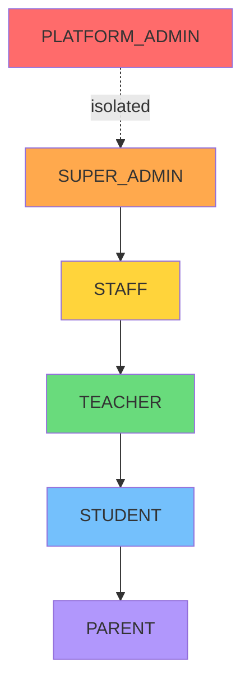

# Roles & Permissions

6-role RBAC system with endpoint-level authorization.

## Role Hierarchy

```mermaid
graph TD
    PA[PLATFORM_ADMIN] -.isolated.-> SA[SUPER_ADMIN]
    SA --> ST[STAFF]
    ST --> TC[TEACHER]
    TC --> STU[STUDENT]
    STU --> P[PARENT]

    style PA fill:#ff6b6b
    style SA fill:#ffa94d
    style ST fill:#ffd43b
    style TC fill:#69db7c
    style STU fill:#74c0fc
    style P fill:#b197fc
```

| Role            | Scope        | Description                        |
|-----------------|--------------|------------------------------------|
| `PLATFORM_ADMIN`| All tenants  | SaaS platform operator             |
| `SUPER_ADMIN`   | Single tenant| School owner/principal             |
| `STAFF`         | Single tenant| Administrative staff               |
| `TEACHER`       | Single tenant| Teaching staff                     |
| `STUDENT`       | Single tenant| Enrolled student                   |
| `PARENT`        | Single tenant| Parent/guardian of student(s)      |

## Endpoint Access Matrix

| Endpoint Group         | PLATFORM_ADMIN | SUPER_ADMIN | STAFF | TEACHER | STUDENT | PARENT |
|------------------------|:--------------:|:-----------:|:-----:|:-------:|:-------:|:------:|
| `/auth/*`              | ✅             | ✅          | ✅    | ✅      | ✅      | ✅     |
| `/users` (CRUD)        | ✅             | ✅          | ✅ R  | ❌      | ❌      | ❌     |
| `/classes` (internal)  | ✅             | ✅          | ✅    | ✅ R*   | ❌      | ❌     |
| `/subjects` (internal) | ✅             | ✅          | ✅    | ✅ R*   | ❌      | ❌     |
| `/exams` (CRUD)        | ✅             | ✅          | ✅    | ✅ R/W  | ✅ R    | ✅ R   |
| `/scores` (internal)   | ✅             | ✅          | ✅    | ✅ R/W* | ❌      | ❌     |
| `/reports` (internal)  | ❌             | ✅          | ✅    | ✅ R*   | ❌      | ❌     |
| `/settings` (internal) | ❌             | ✅          | ✅ R* | ✅ R*   | ❌      | ❌     |
| `/timetables` (CRUD)   | ✅             | ✅          | ✅    | ✅ R    | ✅ R    | ❌     |
| `/assignments` (CRUD)  | ✅             | ✅          | ✅    | ✅ R/W  | ✅ R/W  | ❌     |
| `/study-units` (CRUD)  | ✅             | ✅          | ✅    | ✅      | ❌      | ❌     |
| `/tenants` (CRUD)      | ✅             | ❌          | ❌    | ❌      | ❌      | ❌     |
| `/subscription-plans`  | ✅             | ❌          | ❌    | ❌      | ❌      | ❌     |
| `/tenants/:id/scores`  | ❌             | ✅          | ✅    | ❌      | ❌      | ❌     |

✅ = Full CRUD | ✅ R = Read only | ✅ R/W = Read + Write | ❌ = No access
`*` = giới hạn theo module permission và, nếu có phân công, theo phạm vi lớp/môn.

## UI Menu Visibility

| Menu Item        | PLATFORM_ADMIN | SUPER_ADMIN | STAFF | TEACHER | STUDENT | PARENT |
|------------------|:--------------:|:-----------:|:-----:|:-------:|:-------:|:------:|
| Dashboard        | ✅             | ✅          | ✅    | ✅      | ✅      | ✅     |
| Users            | ✅             | ✅          | ✅    | ❌      | ❌      | ❌     |
| Classes          | ✅             | ✅          | ✅    | ✅      | ✅      | ❌     |
| Exams & Scores   | ✅             | ✅          | ✅    | ✅      | ✅      | ✅     |
| Timetables       | ✅             | ✅          | ✅    | ✅      | ✅      | ❌     |
| Assignments      | ✅             | ✅          | ✅    | ✅      | ✅      | ❌     |
| Study Units      | ✅             | ✅          | ✅    | ✅      | ❌      | ❌     |
| Tenants          | ✅             | ❌          | ❌    | ❌      | ❌      | ❌     |
| Subscription     | ✅             | ❌          | ❌    | ❌      | ❌      | ❌     |

## Role Escalation Prevention

The `PUT /users/:id` endpoint enforces strict role assignment:

- Only `SUPER_ADMIN`, `STAFF`, and `TEACHER` roles can be assigned via user update
- `PLATFORM_ADMIN` and `STUDENT` roles cannot be assigned through the user PUT endpoint
- Role changes are validated server-side regardless of client-supplied payload

Implementation: [`backend/src/middleware/auth.js`](../../../backend/src/middleware/auth.js) — `authorize(...roles)` function checks `req.user.role` against a whitelist before proceeding.

## Feature + Module Permission

Tenant modules dùng 2 lớp:
1. `requireFeature(moduleKey)` kiểm tra `tenant_settings.enabledModules`.
2. `requireRolePermission(moduleKey)` kiểm tra `tenant_settings.rolePermissions` cho `STAFF`/`TEACHER`.

`SUPER_ADMIN` và `PLATFORM_ADMIN` bypass `requireRolePermission`, nhưng vẫn đi qua feature flag.

Teacher chỉ có thể được cấp các module backend hỗ trợ thật:
`student-lookup`, `classes`, `subjects`, `scores`, `reports`.

STAFF có thể được phân công theo cặp lớp+môn. Nếu STAFF có ít nhất một phân công,
dữ liệu lớp, học sinh, môn, điểm, báo cáo, xuất dữ liệu sẽ bị giới hạn theo phân công.
STAFF chưa có phân công giữ phạm vi theo module như trước.

Parent/Student chỉ dùng self-service endpoints:
- `GET /api/parents/my-children`
- `GET /api/parents/my-children/:studentId/scores`
- `GET /api/parents/semesters`

## Related

- [Authentication Overview](overview.md) — JWT token mechanics
- [Middleware Chain](middleware-chain.md) — authorize middleware implementation
- [Login Flows](login-flows.md) — role-specific login responses
- [`backend/src/middleware/auth.js`](../../../backend/src/middleware/auth.js) — authorize function
