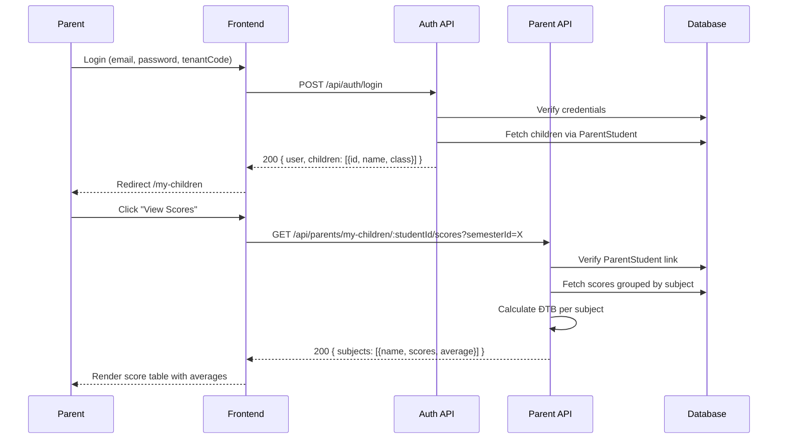

# Parent Viewing Children's Scores

## Overview
Authenticated parent views scores for their linked children.

## User Journey

1. Parent logs in (email + password + tenantCode)
2. Login response includes `children` array (from `ParentStudent` relation)
3. Redirected to `/my-children`
4. `GET /api/parents/my-children` → Returns children with class info
5. Renders list of children with "View Scores" button
6. Click "View Scores" → `/my-children/:studentId/scores`
7. `GET /api/parents/my-children/:studentId/scores?semesterId=X`
8. Backend verifies parent is linked to student via `ParentStudent`
9. Returns scores grouped by subject with calculated averages
10. Frontend displays score table with ĐTB (Điểm trung bình)

## Sequence Diagram



## Request/Response

```json
// GET /api/parents/my-children
// Response 200
{
  "children": [
    { "id": "stu_1", "name": "Nguyễn Văn A", "class": "10A1" }
  ]
}

// GET /api/parents/my-children/:studentId/scores?semesterId=1
// Response 200
{
  "subjects": [
    {
      "name": "Toán",
      "scores": [
        { "component": "Miệng", "value": 8.0 },
        { "component": "15p", "value": 7.5 },
        { "component": "Tiết", "value": 8.0 },
        { "component": "HK", "value": 8.5 }
      ],
      "average": 8.13
    }
  ]
}
```

## Related
- [Score Entry Flow](./score-entry-flow.md)
- [Registration Flow](./registration-flow.md)
- [backend/src/routes/parent.routes.js](../../../backend/src/routes/parent.routes.js)
- [frontend/src/app/(dashboard)/my-children/](../../../frontend/src/app/(dashboard)/my-children/)
