# School Registration Flow

## Overview
End-to-end flow for new school registration, tenant creation, and initial admin setup.

## User Journey

1. User visits `/register`
2. Inputs: School Name, Admin Email, Admin Name, Password, optional Plan
3. Submits form → `POST /api/auth/register-school`

## Backend Processing

| Step | Action |
|------|--------|
| a | Validate inputs (email format, password ≥8 chars, school name ≥3 chars) |
| b | Generate tenant code: `schoolName.toUpperCase() + random3Chars` (e.g., `THPTDEMOA1B`) |
| c | Hash password with bcrypt (10 rounds) |
| d | Single transaction: Create Tenant + Settings + Grades (Khối 10, 11, 12) + SUPER_ADMIN user |
| e | Generate JWT, set httpOnly cookie |

## Sequence Diagram

```mermaid
sequenceDiagram
    participant U as User
    participant F as Frontend
    participant A as Auth API
    participant D as Database

    U->>F: Fill registration form
    F->>A: POST /api/auth/register-school
    A->>A: Validate inputs
    A->>A: Generate tenant code
    A->>A: Hash password (bcrypt)
    A->>D: BEGIN TRANSACTION
    A->>D: INSERT Tenant + Settings
    A->>D: INSERT Grades (10, 11, 12)
    A->>D: INSERT SUPER_ADMIN user
    A->>D: COMMIT
    A->>A: Generate JWT + set httpOnly cookie
    A-->>F: 201 { tenant, user, token }
    F-->>U: Redirect to /dashboard
```



## Request/Response

```json
// POST /api/auth/register-school
{
  "schoolName": "THPT Demo",
  "adminEmail": "admin@demo.edu.vn",
  "adminName": "Admin User",
  "password": "securePass123",
  "plan": "standard"
}

// Response 201
{
  "tenant": { "id": "...", "code": "THPTDEMOA1B", "name": "THPT Demo" },
  "user": { "id": "...", "email": "admin@demo.edu.vn", "role": "SUPER_ADMIN" },
  "token": "eyJhbGci..."
}
```

## Related
- [Environment Variables](../deployment/environment-variables.md)
- [API Routes](../../api/auth-routes.md)
- [backend/src/routes/auth.routes.js](../../../backend/src/routes/auth.routes.js)
