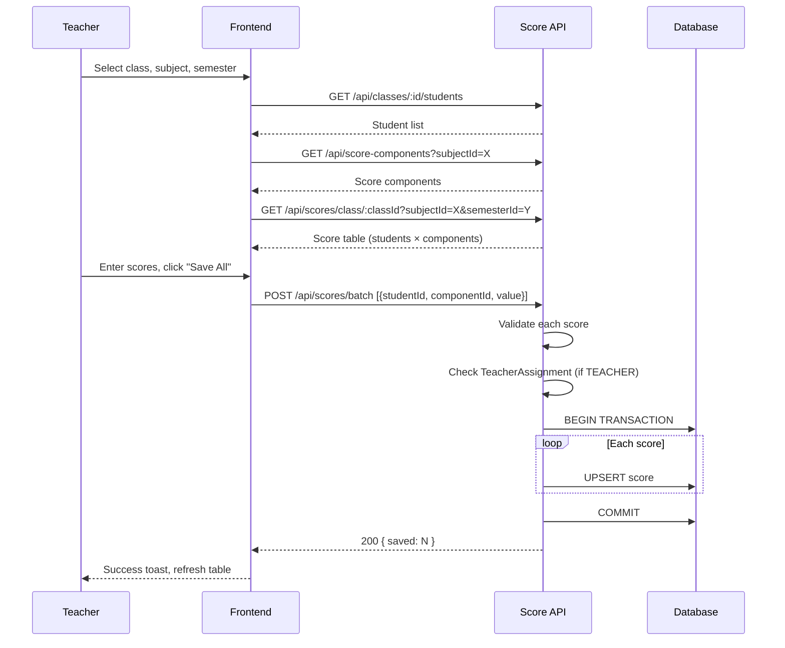

# Score Entry Flow

## Overview
Teacher/staff enters scores for students in a class, subject, and semester.

## User Journey

1. Teacher visits `/scores`
2. Selects Class → `GET /api/classes/:id/students`
3. Selects Subject → `GET /api/score-components?subjectId=X`
4. Selects Semester
5. `GET /api/scores/class/:classId?subjectId=X&semesterId=Y` → Loads score table
6. Frontend renders table: Rows = Students, Columns = Score Components
7. User enters scores, clicks "Save All" → `POST /api/scores/batch`

## Backend Validation

| Check | Rule |
|-------|------|
| Score range | 0 ≤ value ≤ 10 |
| Lock status | `isLocked === false` |
| Component ownership | Score component belongs to subject |
| Tenant validation | All students belong to tenant |
| Teacher assignment | TEACHER role must have `TeacherAssignment` for this class |

## Sequence Diagram



## Request/Response

```json
// POST /api/scores/batch
[
  { "studentId": "stu_1", "componentId": "comp_1", "value": 8.5 },
  { "studentId": "stu_1", "componentId": "comp_2", "value": 7.0 }
]

// Response 200
{ "saved": 2 }
```

## Related
- [Parent Viewing Flow](./parent-viewing-flow.md)
- [backend/src/routes/score.routes.js](../../../backend/src/routes/score.routes.js)
- [frontend/src/app/(dashboard)/scores/](../../../frontend/src/app/(dashboard)/scores/)
