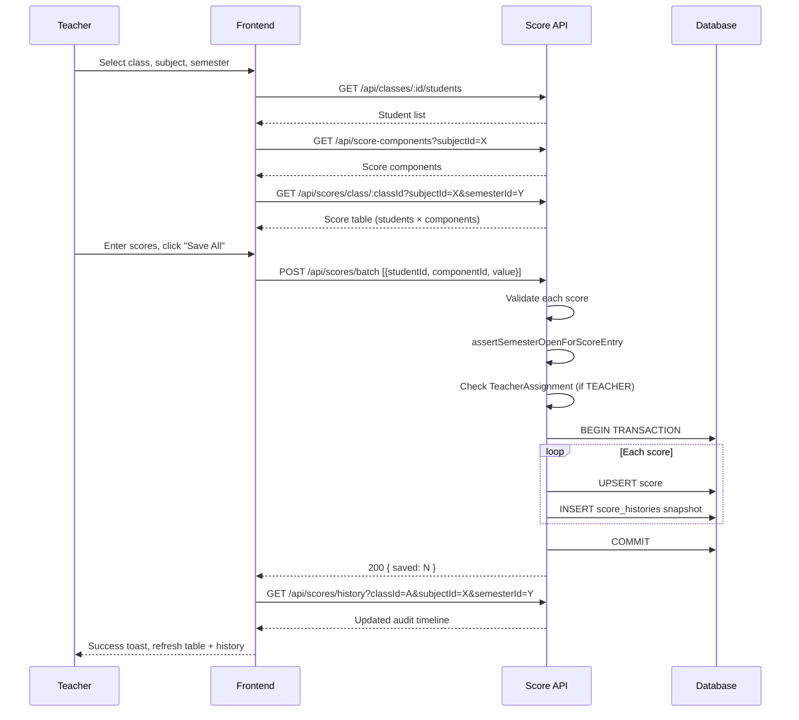

# Score Entry Flow

## Overview
Teacher/staff enters scores for students in a class, subject, and semester.

## User Journey

1. Teacher visits `/scores`
2. Frontend fetches semesters from `GET /api/academic-years/semesters` and marks each term as `Đang mở nhập điểm` or `Đã đóng nhập điểm` from `semester.isActive`
3. Selects Class → `GET /api/classes/:id/students`
4. Selects Subject → `GET /api/score-components?subjectId=X`
5. Selects Semester
6. `GET /api/scores/class/:classId?subjectId=X&semesterId=Y` → Loads score table
7. `GET /api/scores/history?classId=A&subjectId=X&semesterId=Y` → Loads audit timeline for the same context
8. Frontend renders table: Rows = Students, Columns = Score Components
9. User enters scores, clicks "Save All" → `POST /api/scores/batch`
10. Frontend refreshes both the score table and the history panel; it also re-fetches semesters when the tab regains focus so deleted terms disappear immediately

## Backend Validation

| Check | Rule |
|-------|------|
| Score range | 0 ≤ value ≤ 10 |
| Lock status | `isLocked === false` |
| Component ownership | Score component belongs to subject |
| Component/Subject active | `subject.isActive === true` và `scoreComponent.isActive === true` |
| Tenant validation | All students belong to tenant |
| Teacher assignment | TEACHER phải có `TeacherAssignment` đúng `classId + subjectId` |
| Semester entry status | Semester phải được `isActive === true`; `startDate/endDate` chỉ dùng để hiển thị lịch trên UI |
| Student source by semester | Ưu tiên `ClassEnrollment` theo `semesterId`; fallback `student.classId` cho dữ liệu legacy |

## Sequence Diagram


```mermaid
sequenceDiagram
    participant T as Teacher
    participant F as Frontend
    participant S as Score API
    participant D as Database

    T->>F: Select class, subject, semester
    F->>S: GET /api/classes/:id/students
    S-->>F: Student list
    F->>S: GET /api/score-components?subjectId=X
    S-->>F: Score components
    F->>S: GET /api/scores/class/:classId?subjectId=X&semesterId=Y
    S-->>F: Score table (students × components)
    T->>F: Enter scores, click "Save All"
    F->>S: POST /api/scores/batch [{studentId, componentId, value}]
    S->>S: Validate each score
    S->>S: assertSemesterOpenForScoreEntry
    S->>S: Check TeacherAssignment (if TEACHER)
    S->>D: BEGIN TRANSACTION
    loop Each score
        S->>D: UPSERT score
      S->>D: INSERT score_histories snapshot
    end
    S->>D: COMMIT
    S-->>F: 200 { saved: N }
    F->>S: GET /api/scores/history?classId=A&subjectId=X&semesterId=Y
    S-->>F: Updated audit timeline
    F-->>T: Success toast, refresh table + history
```

## Request/Response

```json
// POST /api/scores/batch
[
  { "studentId": "stu_1", "componentId": "comp_1", "value": 8.5 },
  { "studentId": "stu_1", "componentId": "comp_2", "value": 7.0 }
]

// Response 200
{ "saved": 2 }

// Response 403 (semester inactive)
{ "error": { "code": "SEMESTER_CLOSED" } }
```

## Related
- [Parent Viewing Flow](./parent-viewing-flow.md)
- [backend/src/routes/score.routes.js](../../../backend/src/routes/score.routes.js)
- [frontend/src/app/(dashboard)/scores/](../../../frontend/src/app/(dashboard)/scores/)
