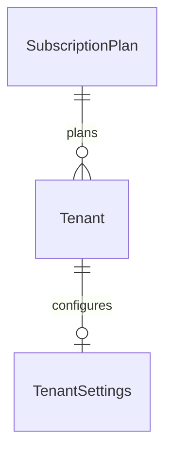

# Platform Models

> **Source:** `backend/prisma/schema.prisma` | Lines ~14-97

## SubscriptionPlan

Defines SaaS pricing tiers with resource limits per tenant.

```prisma
model SubscriptionPlan {
  id            String   @id @default(uuid())
  name          String   @unique
  price         Float    @default(0)
  studentLimit  Int      @default(100)
  teacherLimit  Int      @default(20)
  classLimit    Int      @default(30)
  description   String?
  features      String[] @default([])
  isActive      Boolean  @default(true)
  createdAt     DateTime @default(now())
  updatedAt     DateTime @updatedAt

  tenants       Tenant[]
}
```

| Field | Type | Notes |
|---|---|---|
| `name` | `String @unique` | Plan identifier (e.g., "Basic", "Pro") |
| `price` | `Float` | Monthly subscription cost |
| `studentLimit` | `Int` | Max students per tenant |
| `teacherLimit` | `Int` | Max teachers per tenant |
| `classLimit` | `Int` | Max classes per tenant |
| `features` | `String[]` | Array of feature flags |

## Tenant

Represents a single school organization in the multi-tenant SaaS.

```prisma
model Tenant {
  id        String       @id @default(uuid())
  name      String
  code      String       @unique
  address   String?
  phone     String?
  email     String?
  status    TenantStatus @default(ACTIVE)
  planId    String?
  plan      SubscriptionPlan? @relation(fields: [planId], references: [id])
  // ... relations omitted
}
```

| Field | Type | Notes |
|---|---|---|
| `code` | `String @unique` | Short identifier for URL/API routing |
| `status` | `TenantStatus` | `ACTIVE`, `SUSPENDED`, `INACTIVE` |
| `planId` | `String?` | FK to `SubscriptionPlan` |

## TenantSettings

All configurable settings per tenant with role-based JSON permissions.

```prisma
model TenantSettings {
  id              String  @id @default(uuid())
  tenantId        String  @unique
  tenant          Tenant  @relation(fields: [tenantId], references: [id], onDelete: Cascade)
  minAge          Int     @default(15)
  maxAge          Int     @default(20)
  maxClassSize    Int     @default(40)
  passScore       Float   @default(5.0)
  minGradeLevel   Int     @default(10)
  maxGradeLevel   Int     @default(12)
  maxSubjects     Int     @default(9)
  minScore        Float   @default(0)
  maxScore        Float   @default(10)
  maxSemesters    Int     @default(2)
  maxRetentions   Int     @default(3)
  rolePermissions Json?   @default("{}")
}
```

| Setting | Default | Purpose |
|---|---|---|
| `minAge` / `maxAge` | 15 / 20 | Student age range validation |
| `maxClassSize` | 40 | Class enrollment cap |
| `passScore` | 5.0 | Minimum passing score |
| `minScore` / `maxScore` | 0 / 10 | Score value range |
| `maxSubjects` | 9 | Max subjects per student |
| `maxSemesters` | 2 | Semesters per academic year |
| `maxRetentions` | 3 | Max times a student can repeat |
| `rolePermissions` | `{}` | JSON map of role → permission sets |

## Relationships



- `SubscriptionPlan` → `Tenant`: One plan can serve many tenants
- `Tenant` → `TenantSettings`: One-to-one, cascade delete on tenant removal

## Related

- [Schema Overview](./schema-overview.md)
- [User Models](./user-models.md)
- [Indexes & Performance](./indexes-performance.md)
