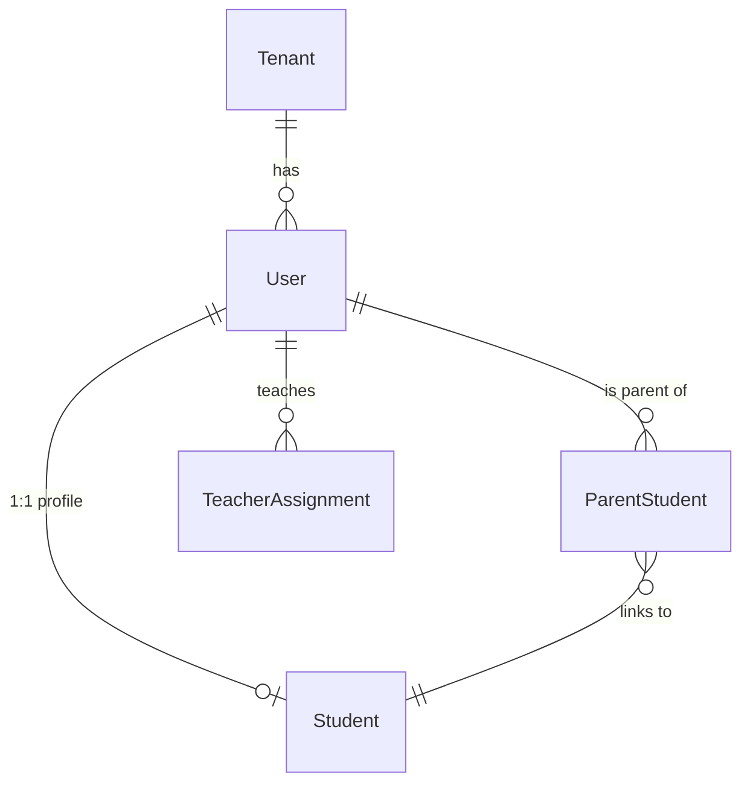

# User Models

> **Source:** `backend/prisma/schema.prisma` | Lines ~100-180

## User

Core authentication and identity model with role-based access.

```prisma
model User {
  id          String   @id @default(uuid())
  tenantId    String?
  tenant      Tenant?  @relation(fields: [tenantId], references: [id], onDelete: Cascade)
  email       String
  password    String
  fullName    String
  role        UserRole @default(TEACHER)
  phone       String?
  department  String?
  isActive    Boolean  @default(true)
  createdAt   DateTime @default(now())
  updatedAt   DateTime @updatedAt

  children           ParentStudent[]
  teacherAssignments TeacherAssignment[]
  studentProfile     Student?         @relation("StudentUser")

  @@unique([tenantId, email])
  @@index([tenantId, role])
}
```

| Field | Type | Notes |
|---|---|---|
| `tenantId` | `String?` | Nullable for platform admins |
| `email` | `String` | Login identifier |
| `password` | `String` | Hashed (bcrypt/argon2) |
| `role` | `UserRole` | See enums below |
| `isActive` | `Boolean` | Soft-disable without deletion |

### Unique Constraint: `(tenantId, email)`

Ensures email uniqueness **per tenant**, not globally. This allows the same email to exist across different schools while preventing duplicates within one school.

### Index: `(tenantId, role)`

Optimizes queries like: "list all teachers in tenant X" or "find all parents in tenant Y".

## UserRole Enum

```prisma
enum UserRole {
  PLATFORM_ADMIN  // System-wide admin
  SUPER_ADMIN     // School-level admin
  STAFF           // Administrative staff
  TEACHER         // Teaching staff
  STUDENT         // Student (may have login)
  PARENT          // Parent/guardian
}
```

## ParentStudent

Junction table linking parents (Users) to students.

```prisma
model ParentStudent {
  id           String   @id @default(uuid())
  parentId     String
  parent       User     @relation(fields: [parentId], references: [id], onDelete: Cascade)
  studentId    String
  student      Student  @relation(fields: [studentId], references: [id], onDelete: Cascade)
  relationship String   @default("PARENT")
  isPrimary    Boolean  @default(false)
  createdAt    DateTime @default(now())

  @@unique([parentId, studentId])
}
```

| Field | Type | Notes |
|---|---|---|
| `parentId` | `String` | FK to `User.id` |
| `studentId` | `String` | FK to `Student.id` |
| `relationship` | `String` | "PARENT", "GUARDIAN", etc. |
| `isPrimary` | `Boolean` | Primary contact for notifications |

## StudentUser Relation

One student profile per user (1:1 optional):

```prisma
// In User model:
studentProfile  Student?  @relation("StudentUser")

// In Student model:
userId  String?  @unique
user    User?    @relation("StudentUser", fields: [userId], references: [id])
```

This allows students to have login accounts while keeping `User` and `Student` as separate concerns.

## TeacherAssignment Relation

Teachers are assigned to classes and subjects via `TeacherAssignment`:

```prisma
// In User model:
teacherAssignments TeacherAssignment[]

// In TeacherAssignment model:
teacherId  String
teacher    User @relation(fields: [teacherId], references: [id], onDelete: Cascade)
```

## Relationships



## Related

- [Schema Overview](./schema-overview.md)
- [Platform Models](./platform-models.md)
- [Academic Structure](./academic-structure.md)
- [Indexes & Performance](./indexes-performance.md)
