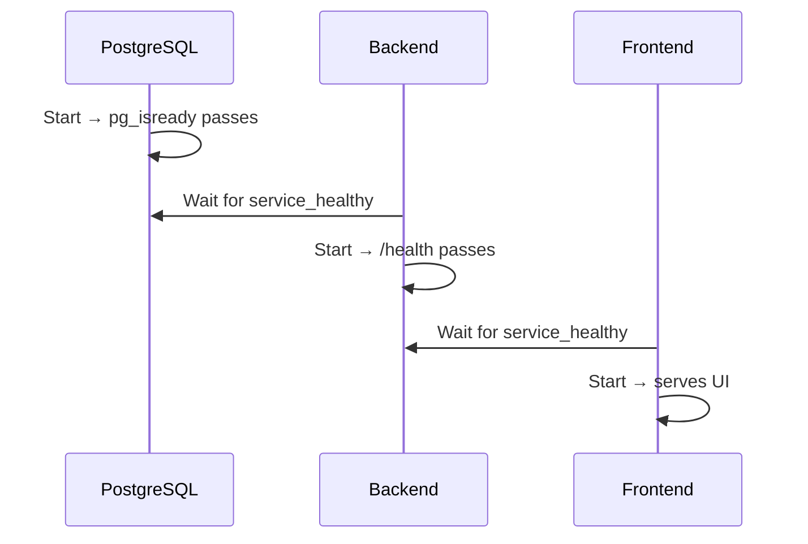

# Ports & Services

## Port Mapping

| Service | Port | Protocol | Purpose |
|---------|------|----------|---------|
| Frontend | 3000 | HTTP | Next.js dev server |
| Backend API | 5001 (dev), 5000 (prod) | HTTP | Express.js REST API |
| PostgreSQL | 5432 | TCP | Database |
| Prisma Studio | 5555 | HTTP | Database GUI (dev only) |

## Service Dependencies

```
Frontend → Backend (API calls)
Backend → PostgreSQL (database)
Frontend → Browser (user access)
```

## Health Check Flow



## CORS Configuration

Backend allows frontend origin via `CORS_ORIGIN` env variable:

```js
// backend/src/app.js
app.use(cors({
  origin: process.env.CORS_ORIGIN,
  credentials: true  // Enables httpOnly cookies
}));
```

## Startup Order

1. **PostgreSQL** initializes → `pg_isready` confirms readiness
2. **Backend** starts after DB healthy → `/health` endpoint responds
3. **Frontend** starts after Backend healthy → serves Next.js UI

## Related
- [Docker Setup](./docker-setup.md)
- [Environment Variables](./environment-variables.md)
- [docker-compose.yml](../../../docker-compose.yml)
- [backend/src/app.js](../../../backend/src/app.js)
