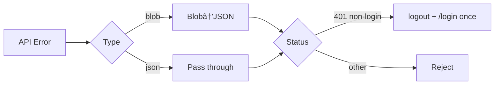

# Axios API Client

## Configuration

```ts
// frontend/src/lib/api.ts
if (process.env.NODE_ENV === 'production' && !process.env.NEXT_PUBLIC_API_URL) {
  throw new Error('NEXT_PUBLIC_API_URL is required in production')
}

const API_URL = process.env.NEXT_PUBLIC_API_URL || 'http://localhost:5001/api'

export const api = axios.create({
  baseURL: API_URL,
  withCredentials: true,
  headers: { 'Content-Type': 'application/json' },
})
```

## Interceptors

### Request — Auto-attach token

```ts
api.interceptors.request.use((config) => {
  const token = useAuthStore.getState().token
  if (token) config.headers.Authorization = `Bearer ${token}`
  return config
})
```

### Response — 401 handling + blob error parsing

```ts
let isUnauthorizedHandling = false

const handleUnauthorized = () => {
  if (isUnauthorizedHandling) return
  isUnauthorizedHandling = true
  useAuthStore.getState().logout()
  if (typeof window !== 'undefined') window.location.href = '/login'
}

api.interceptors.response.use(
  (response) => response,
  async (error: AxiosError) => {
    // Parse blob errors (for export endpoints)
    if (error.config?.responseType === 'blob' && error.response?.data instanceof Blob) {
      try {
        const text = await (error.response.data as Blob).text()
        error.response.data = JSON.parse(text)
      } catch {}
    }
    // Auto-logout on 401 (except failed login), de-duplicated to avoid redirect races
    const isLoginRequest = error.config?.url?.includes('/auth/login')
    if (error.response?.status === 401 && !isLoginRequest) {
      handleUnauthorized()
    }
    return Promise.reject(error)
  }
)
```

## Error Flow


```mermaid
flowchart LR
    A[API Error] --> B{Type}
    B -->|blob| C[Blob→JSON]
    B -->|json| D[Pass through]
    C --> E{Status}
    D --> E
    E -->|401 non-login| F[logout + /login once]
    E -->|other| G[Reject]
```

## API Modules (18)

| Module | Endpoints |
|--------|-----------|
| `authApi` | login, registerSchool, getPlans, me, logout |
| `adminApi` | dashboard, schools/subscriptions CRUD |
| `userApi` | users CRUD, disable, assignments |
| `studentApi` | students CRUD, transfer, history |
| `classApi` | classes CRUD, grades, assignments |
| `subjectApi` | subjects CRUD, semesters CRUD |
| `scoreComponentApi` | score components by subject |
| `scoreApi` | by class/student, batch save, lock/unlock |
| `promotionApi` | calculate, override, promote, archive |
| `reportApi` | summaries, dashboard, transfer, retention |
| `parentApi` | parents CRUD, link/unlink, my-children |
| `settingsApi` | settings, grades, role permissions |
| `tenantApi` | current tenant, update, stats |
| `exportApi` | export students/classes/scores/schools |
| `monitoringApi` | system stats, activity logs |
| `academicYearApi` | academic years CRUD |

## Blob Download Helper

```ts
export function downloadBlob(blob: Blob, filename: string) {
  const url = URL.createObjectURL(blob)
  const a = document.createElement('a')
  a.href = url; a.download = filename
  document.body.appendChild(a); a.click()
  document.body.removeChild(a); URL.revokeObjectURL(url)
}
```
## Related

- [./state-management.md](./state-management.md) — AuthStore token source
- [../authentication/overview.md](../authentication/overview.md) — Backend auth
