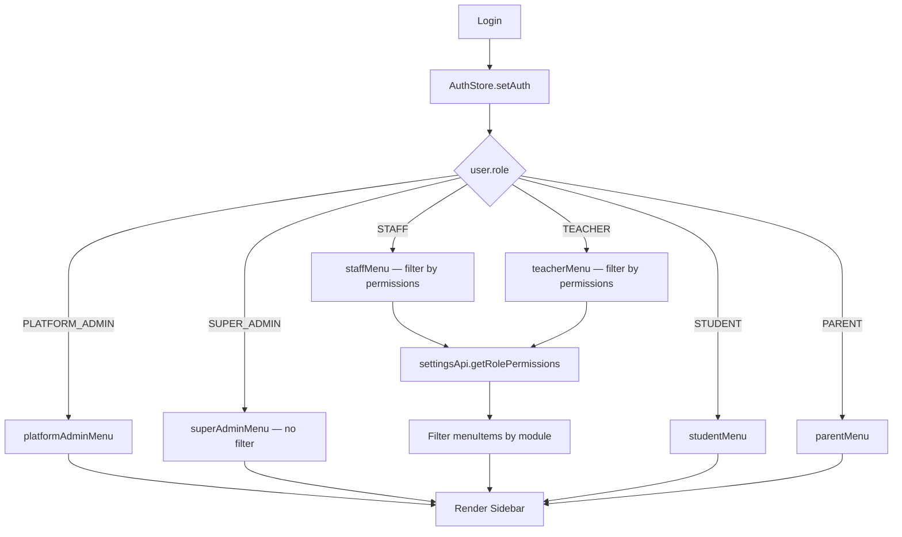

# Role-Based UI & Menu

## Menu Visibility by Role

| Menu | PLATFORM_ADMIN | SUPER_ADMIN | STAFF | TEACHER | STUDENT | PARENT |
|------|:-:|:-:|:-:|:-:|:-:|:-:|
| Tổng quan (Dashboard) | ✅ | ✅ | ✅ | ✅ | ✅ | ❌ |
| Quản lý trường | ✅ | ❌ | ❌ | ❌ | ❌ | ❌ |
| Gói đăng ký | ✅ | ❌ | ❌ | ❌ | ❌ | ❌ |
| Giám sát hệ thống | ✅ | ❌ | ❌ | ❌ | ❌ | ❌ |
| Nhật ký hoạt động | ✅ | ❌ | ❌ | ❌ | ❌ | ❌ |
| Quản lý người dùng | ❌ | ✅ | ❌ | ❌ | ❌ | ❌ |
| Tiếp nhận HS | ❌ | ✅ | ✅* | ❌ | ❌ | ❌ |
| Tra cứu HS | ❌ | ✅ | ✅* | ✅* | ❌ | ❌ |
| Danh sách lớp | ❌ | ✅ | ✅* | ✅* | ❌ | ❌ |
| Môn học | ❌ | ✅ | ✅* | ❌ | ❌ | ❌ |
| Nhập điểm | ❌ | ✅ | ✅* | ✅* | ❌ | ❌ |
| Xét lên lớp | ❌ | ✅ | ✅* | ❌ | ❌ | ❌ |
| Báo cáo | ❌ | ✅ | ✅* | ✅* | ❌ | ❌ |
| Quản lý Phụ huynh | ❌ | ✅ | ✅* | ❌ | ❌ | ❌ |
| Quản lý học phí | ❌ | ✅ | ✅* | ❌ | ❌ | ✅ |
| Quy định | ❌ | ✅ | ❌ | ❌ | ❌ | ❌ |
| Năm học | ❌ | ✅ | ❌ | ❌ | ❌ | ❌ |
| Phân quyền | ❌ | ✅ | ❌ | ❌ | ❌ | ❌ |
| Xuất dữ liệu | ❌ | ❌ | ✅* | ❌ | ❌ | ❌ |
| Xem điểm | ❌ | ❌ | ❌ | ❌ | ✅ | ❌ |
| Con em của tôi | ❌ | ❌ | ❌ | ❌ | ❌ | ✅ |

*`*` = filtered by role permissions from `settingsApi.getRolePermissions()`

## Role → Menu Mapping

```tsx
// frontend/src/app/(dashboard)/layout.tsx
switch (user?.role) {
  case 'PLATFORM_ADMIN': items = platformAdminMenu; break
  case 'SUPER_ADMIN':    items = superAdminMenu;    break
  case 'STAFF':          items = staffMenu;          break
  case 'TEACHER':        items = teacherMenu;        break
  case 'STUDENT':        items = studentMenu;        break
  case 'PARENT':         items = parentMenu;         break
}
```

## Permission Filtering (STAFF / TEACHER)

```ts
// Filter menu items by allowed modules from backend
const allowed = rolePermissions[user.role] || []
items = items.filter(item => !item.module || allowed.includes(item.module))
```

- `module` field on each menu item maps to a permission key
- SUPER_ADMIN bypasses permission filtering (full access)
- If permissions fail to load → fallback: show all items

## Architecture



## Role Summary

| Role | Portal | Key Differentiator |
|------|--------|-------------------|
| PLATFORM_ADMIN | Separate school management | Manages schools, subscriptions, monitoring |
| SUPER_ADMIN | Full school access | Unrestricted school-level management |
| STAFF | Permission-filtered | Configurable module access |
| TEACHER | Permission-filtered | Class & score focused |
| STUDENT | Read-only | "Xem điểm" (My Scores) only |
| PARENT | Read-only | "Con em của tôi" (My Children) + fees |

## Related

- [./state-management.md](./state-management.md) — `User` type and `UserRole` definition
- [./routing-structure.md](./routing-structure.md) — Route structure behind each menu item
- [../authentication/roles-permissions.md](../authentication/roles-permissions.md) — Backend role definitions
