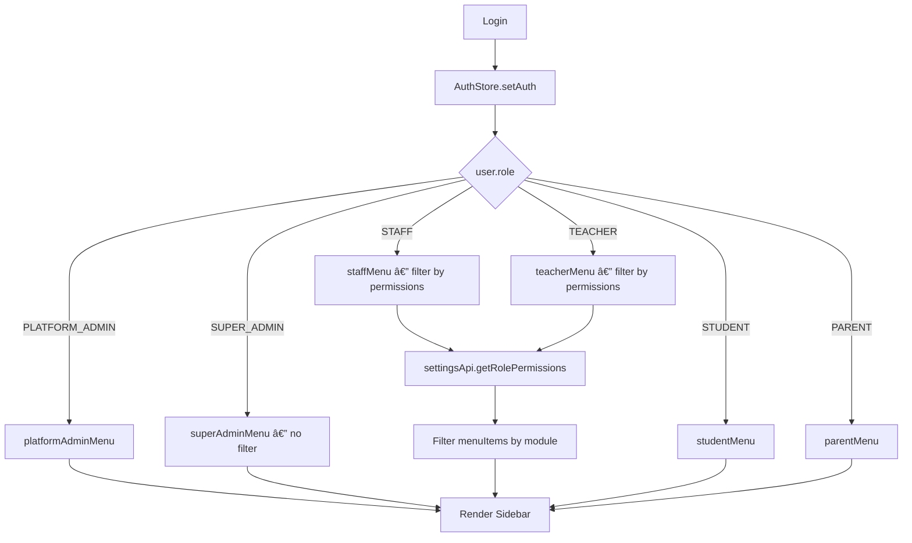

# Role-Based UI & Menu

## Menu Visibility by Role

| Menu | PLATFORM_ADMIN | SUPER_ADMIN | STAFF | TEACHER | STUDENT | PARENT |
|------|:-:|:-:|:-:|:-:|:-:|:-:|
| Tổng quan (Dashboard) | ✅ | ✅ | ✅ | ✅ | ✅ | ❌ |
| Quản lý trường | ✅ | ❌ | ❌ | ❌ | ❌ | ❌ |
| Gói đăng ký | ✅ | ❌ | ❌ | ❌ | ❌ | ❌ |
| Giám sát hệ thống | ✅ | ❌ | ❌ | ❌ | ❌ | ❌ |
| Nhật ký hoạt động | ✅ | ❌ | ❌ | ❌ | ❌ | ❌ |
| Quản lý người dùng | ❌ | ✅ | ❌ | ❌ | ❌ | ❌ |
| Tiếp nhận HS | ❌ | ✅ | ✅* | ❌ | ❌ | ❌ |
| Tra cứu HS | ❌ | ✅ | ✅* | ✅* | ❌ | ❌ |
| Danh sách lớp | ❌ | ✅ | ✅* | ✅* | ❌ | ❌ |
| Môn học | ❌ | ✅ | ✅* | ❌ | ❌ | ❌ |
| Nhập điểm | ❌ | ✅ | ✅* | ✅* | ❌ | ❌ |
| Xét lên lớp | ❌ | ✅ | ✅* | ❌ | ❌ | ❌ |
| Báo cáo | ❌ | ✅ | ✅* | ✅* | ❌ | ❌ |
| Quản lý Phụ huynh | ❌ | ✅ | ✅* | ❌ | ❌ | ❌ |
| Quản lý học phí | ❌ | ✅ | ✅* | ❌ | ❌ | ✅ |
| Quy định | ❌ | ✅ | ❌ | ❌ | ❌ | ❌ |
| Năm học | ❌ | ✅ | ❌ | ❌ | ❌ | ❌ |
| Phân quyền | ❌ | ✅ | ❌ | ❌ | ❌ | ❌ |
| Xuất dữ liệu | ❌ | ❌ | ✅* | ❌ | ❌ | ❌ |
| Xem điểm | ❌ | ❌ | ❌ | ❌ | ✅ | ❌ |
| Con em của tôi | ❌ | ❌ | ❌ | ❌ | ❌ | ✅ |

*`*` = filtered by role permissions from `settingsApi.getRolePermissions()`

## Role → Menu Mapping

```tsx
// frontend/src/app/(dashboard)/layout.tsx
switch (user?.role) {
  case 'PLATFORM_ADMIN': items = platformAdminMenu; break
  case 'SUPER_ADMIN':    items = superAdminMenu;    break
  case 'STAFF':          items = staffMenu;          break
  case 'TEACHER':        items = teacherMenu;        break
  case 'STUDENT':        items = studentMenu;        break
  case 'PARENT':         items = parentMenu;         break
}
```

## Permission Filtering (STAFF / TEACHER)

```ts
// Filter menu items by allowed modules from backend
const allowed = rolePermissions[user.role] || []
items = items.filter(item => !item.module || allowed.includes(item.module))
```

- `module` field on each menu item maps to a permission key
- SUPER_ADMIN bypasses permission filtering (full access)
- If permissions fail to load → fallback: show all items
- Teacher permission UI only shows backend-supported modules: student lookup, classes, subjects, scores, reports.
- STAFF users with class/subject assignments see scoped academic data; STAFF without assignments keep module-level access.

## Architecture


```mermaid
flowchart TD
    A[Login] --> B[AuthStore.setAuth]
    B --> C{user.role}
    C -->|PLATFORM_ADMIN| D[platformAdminMenu]
    C -->|SUPER_ADMIN| E[superAdminMenu — no filter]
    C -->|STAFF| F[staffMenu — filter by permissions]
    C -->|TEACHER| G[teacherMenu — filter by permissions]
    C -->|STUDENT| H[studentMenu]
    C -->|PARENT| I[parentMenu]
    F --> J[settingsApi.getRolePermissions]
    G --> J
    J --> K[Filter menuItems by module]
    D --> L[Render Sidebar]
    E --> L
    K --> L
    H --> L
    I --> L
```

## Role Summary

| Role | Portal | Key Differentiator |
|------|--------|-------------------|
| PLATFORM_ADMIN | Separate school management | Manages schools, subscriptions, monitoring |
| SUPER_ADMIN | Full school access | Unrestricted school-level management |
| STAFF | Permission-filtered | Configurable module access |
| TEACHER | Permission-filtered | Class & score focused |
| STUDENT | Read-only | "Xem điểm" (My Scores) only |
| PARENT | Read-only | "Con em của tôi" (My Children) |

## 2026 UI Updates

- Teacher dashboard now shows compact basic cards + shortcuts only.
- Teacher `/classes` is treated as **Lớp của tôi** (assigned classes only, card view, quick links to class detail and score entry).
- Class detail for teacher now hides class-management actions (edit class, add/edit student) and handles `403/404` by toast + redirect/fallback instead of blank screen.
- `/scores` supports deep-link query prefill (`classId`, `subjectId`, `semesterId`) for teacher quick navigation.
- SUPER_ADMIN sidebar now has a dedicated `/promotion` entry; promotion workflow moved out of `/reports`.
- Teacher sidebar can show `Môn học` when `subjects` is enabled for Teacher.
- `/promotion` now shows graduate details, failed-student pending placement, placement history, inactive reason, and target-class creation confirmation.
- `/reports`, `/settings`, and `/settings/permissions` were compacted to reduce empty space and improve operator readability.
- `/reports` now uses Vietnamese labels, global year/semester filters, year-scoped semester options, lightweight CSS/SVG charts, and report-scoped API calls so TEACHER users do not need academic-calendar permission.

## Quy ước copy tiếng Việt

- Toàn bộ text hiển thị UI phải dùng tiếng Việt có dấu đầy đủ.
- Thuật ngữ chuẩn cần thống nhất: Học kỳ, Năm học, Báo cáo, Quy định, Phân quyền, Xét lên lớp.
- Không dùng biến thể không dấu như Hoc ky, Nam hoc, Bao cao, Quy dinh, Phan quyen.
- Chuỗi lỗi hiển thị cho người dùng cần ưu tiên map theo `error.code` tại frontend, không phụ thuộc hoàn toàn vào message thô từ backend.
- Không đổi khóa kỹ thuật (module key, role key, route/API params); chỉ chuẩn hóa lớp hiển thị.

## Related

- [./state-management.md](./state-management.md) — `User` type and `UserRole` definition
- [./routing-structure.md](./routing-structure.md) — Route structure behind each menu item
- [../authentication/roles-permissions.md](../authentication/roles-permissions.md) — Backend role definitions
