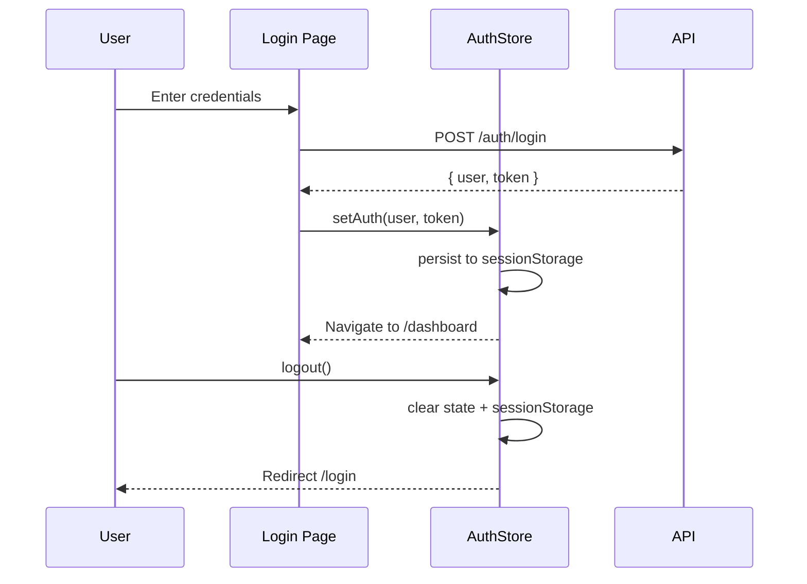

# Zustand State Management

## Auth Store

```ts
// frontend/src/store/auth.ts
import { create } from 'zustand'
import { persist, createJSONStorage } from 'zustand/middleware'

interface Child {
  id: string
  fullName: string
  studentCode: string
  className: string | null
  relationship: string
}

export type UserRole = 'PLATFORM_ADMIN' | 'SUPER_ADMIN' | 'STAFF' | 'TEACHER' | 'STUDENT' | 'PARENT'

interface User {
  id: string
  email: string
  fullName: string
  role: UserRole
  tenantId?: string
  tenant?: { id: string; name: string; code: string }
  children?: Child[]
}

interface AuthState {
  user: User | null
  token: string | null
  isAuthenticated: boolean
  setAuth: (user: User, token: string) => void
  logout: () => void
}

export const useAuthStore = create<AuthState>()(
  persist(
    (set) => ({
      user: null, token: null, isAuthenticated: false,
      setAuth: (user, token) => set({ user, token, isAuthenticated: true }),
      logout: () => set({ user: null, token: null, isAuthenticated: false }),
    }),
    { name: 'auth-storage', storage: createJSONStorage(() => sessionStorage) }
  )
)
```

## Why Zustand Over Redux

| Aspect | Zustand | Redux + Toolkit |
|--------|---------|-----------------|
| Boilerplate | Minimal (1 file) | Actions, reducers, slices |
| Bundle size | ~1 KB | ~13 KB |
| DevX | Direct `useStore()` | `useDispatch` + `useSelector` |
| Persistence | Built-in `persist` | Requires `redux-persist` |

## SessionStorage Persistence

```ts
{ name: 'auth-storage', storage: createJSONStorage(() => sessionStorage) }
```

- Auth survives page refresh within same tab
- **Closing the tab = logout** (tab-scoped storage)

## State Flow



## Usage

```tsx
const { user, isAuthenticated } = useAuthStore()
useAuthStore.getState().token  // read without re-render
```

## Related

- [./api-client.md](./api-client.md) — Axios uses `useAuthStore.getState().token`
- [./routing-structure.md](./routing-structure.md) — Layout checks `isAuthenticated`
- [./role-based-ui.md](./role-based-ui.md) — `user.role` drives menu visibility
