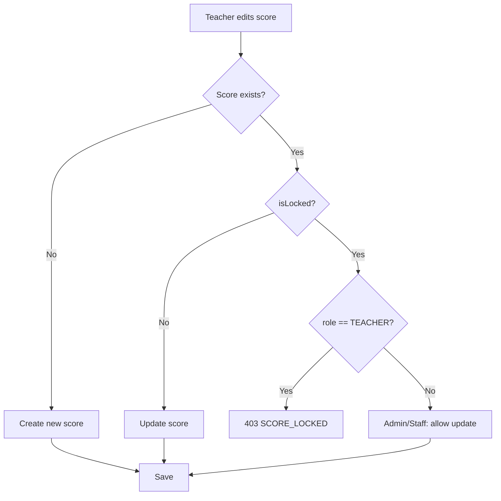
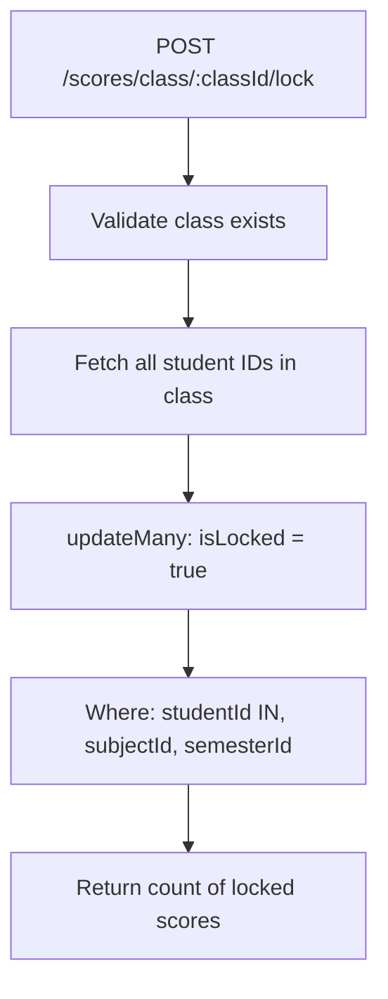

# Score Lock/Unlock

**Last updated:** 2026-04-09 · **Version:** 1.0

The lock mechanism prevents unauthorized modification of scores once they are finalized.

## Model

`Score.isLocked` — boolean field on the Score model. When `true`, the score is immutable for TEACHER role.

## Permissions Matrix

| Action | SUPER_ADMIN | STAFF | TEACHER |
|--------|:-----------:|:-----:|:-------:|
| Lock individual | ✅ | ✅ | ❌ |
| Unlock individual | ✅ | ✅ | ❌ |
| Batch lock class | ✅ | ✅ | ❌ |
| Batch unlock class | ✅ | ✅ | ❌ |
| Edit locked score | ✅ | ✅ | ❌ |
| Delete score | ✅ | ❌ | ❌ |

## Endpoints

| Method | Endpoint | Body | Description |
|--------|----------|------|-------------|
| `PATCH` | `/api/scores/:id/lock` | — | Lock single score |
| `PATCH` | `/api/scores/:id/unlock` | — | Unlock single score |
| `POST` | `/api/scores/class/:classId/lock` | `{ subjectId, semesterId }` | Lock all scores for class |
| `POST` | `/api/scores/class/:classId/unlock` | `{ subjectId, semesterId }` | Unlock all scores for class |

## Lock Enforcement

On `POST /scores` and `POST /scores/batch`, the backend checks:

```js
if (existingScore && existingScore.isLocked && req.user.role === 'TEACHER') {
  throw new AppError('Score is locked. Only Admin/Staff can edit locked scores.', 403, 'SCORE_LOCKED')
}
```

## Flow Diagram



## Batch Lock Flow



## Frontend Behavior

- Locked scores display a 🔒 icon
- Input fields are **disabled** when `isLocked === true`
- Unlock button visible only to SUPER_ADMIN and STAFF roles

## Related

- [Score Components](./score-components.md)
- [Promotion Calculation](./promotion-calculation.md)
- [Source: score.routes.js](../../../backend/src/routes/score.routes.js)
