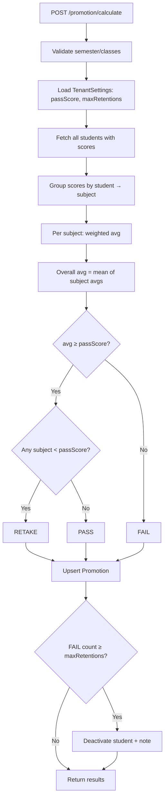

# Promotion Calculation

**Last updated:** 2026-04-09 · **Version:** 1.0

Determines whether each student passes, fails, or requires retake based on weighted semester averages.

## Endpoint

```
POST /api/promotion/calculate
Authorization: Bearer <token>
Roles: SUPER_ADMIN only

{
  "classId": "optional-uuid",   // omit for all classes
  "semesterId": "required-uuid"
}
```

## Logic Flow



## Result Criteria

| Condition | Result |
|-----------|--------|
| `overallAvg ≥ passScore` AND all subjects ≥ passScore | `PASS` |
| `overallAvg ≥ passScore` BUT some subject < passScore | `RETAKE` |
| `overallAvg < passScore` | `FAIL` |

## Transactional Upsert

```js
await prisma.$transaction(async (tx) => {
  for (const r of results) {
    await tx.promotion.upsert({
      where: { studentId_classId_semesterId: { ... } },
      create: { tenantId, ...r },
      update: { average: r.average, result: r.result }
    })
  }
  // Batch groupBy for retention counts
  const failCounts = await tx.promotion.groupBy({
    by: ['studentId'],
    where: { result: 'FAIL' },
    _count: { _all: true }
  })
  // Deactivate if ≥ maxRetentions
})
```

## Retention Auto-Deactivation (QĐ9)

When a student's FAIL count across the academic year reaches `settings.maxRetentions`:
1. Student `isActive` set to `false`
2. Promotion note: *"Ngừng tiếp nhận - vượt quá N lần lưu ban"*

Scoping uses `academicYearId` from the current semester, with fallback to year-string matching.

## Manual Override

```
PUT /api/promotion/:id
Roles: SUPER_ADMIN
{ "result": "PASS|FAIL|RETAKE", "note": "..." }
```

## Year-End Promotion Workflow

`POST /api/promotion/promote` (year-end-promotion.routes.js):

1. **PASS students** → move to next-grade class (or graduate if at maxGradeLevel)
2. **FAIL students** → retain in same grade (class name suffix `-LB`)
3. Auto-creates transfer history records
4. Caches class lookups to avoid duplicate creation

## Related

- [Score Components](./score-components.md)
- [Weighted Score Calculation](./weighted-calculation.md)
- [Score Lock/Unlock](./lock-unlock.md)
- [Source: promotion.routes.js](../../../backend/src/routes/promotion.routes.js)
- [Source: year-end-promotion.routes.js](../../../backend/src/routes/year-end-promotion.routes.js)
