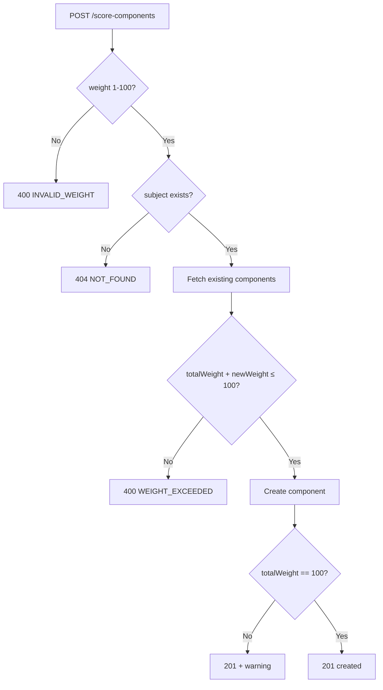

# Score Components (Đầu Điểm)

**Last updated:** 2026-04-09 · **Version:** 1.0

Score components define the configurable score types for each subject, with weight-based contribution to the final average.

## Overview

Each subject can have multiple score components (e.g., *Kiểm tra miệng*, *15 phút*, *1 tiết*, *Cuối kỳ*). The sum of all component weights for a subject must not exceed **100%**.

```
┌─────────────┬───────┬──────────────┐
│ Component   │ Weight│ Contribution  │
├─────────────┼───────┼──────────────┤
│ Miệng       │  10%  │ 10% of ĐTB   │
│ 15 phút     │  20%  │ 20% of ĐTB   │
│ 1 tiết      │  30%  │ 30% of ĐTB   │
│ Cuối kỳ    │  40%  │ 40% of ĐTB   │
└─────────────┴───────┴──────────────┘
```

## CRUD Operations

| Method | Endpoint | Roles | Description |
|--------|----------|-------|-------------|
| `GET` | `/api/score-components` | Authenticated | List all components (filter by `?subjectId=`) |
| `POST` | `/api/score-components` | SUPER_ADMIN, STAFF | Create component |
| `PUT` | `/api/score-components/:id` | SUPER_ADMIN, STAFF | Update component |
| `DELETE` | `/api/score-components/:id` | SUPER_ADMIN, STAFF | Delete (fails if scores exist) |

### Create Request

```json
POST /api/score-components
{
  "name": "15 phút",
  "weight": 20,
  "subjectId": "uuid-here"
}
```

### Validation Flow



## DELETE Protection

Deletion is blocked with `400 HAS_SCORES` if any scores reference the component.

## Response with Warning

When total weight ≠ 100% after create/update:

```json
{
  "data": { "id": "...", "name": "Miệng", "weight": 10 },
  "warning": "Total weight for this subject is 30%, not 100%"
}
```

## Related

- [Weighted Score Calculation](./weighted-calculation.md)
- [Score Lock/Unlock](./lock-unlock.md)
- [Promotion Calculation](./promotion-calculation.md)
- [Source: score-component.routes.js](../../../backend/src/routes/score-component.routes.js)
- [Source: score.routes.js](../../../backend/src/routes/score.routes.js)
