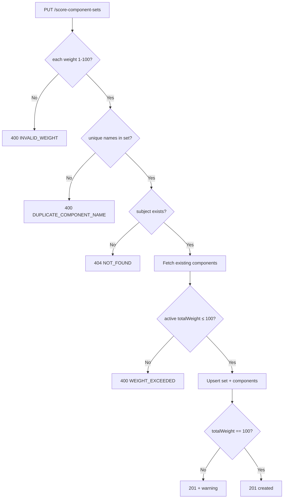

# Score Components (Đầu Điểm)

**Last updated:** 2026-06-05 · **Version:** 2.0

Score components define score columns for one subject in one semester, with weight-based contribution to the final average.

## Overview

Each `Subject + Semester` has one active `ScoreComponentSet`. Every class learning that subject in the same semester uses the same components. Different semesters can use different component sets.

```
┌─────────────┬───────┬──────────────┐
│ Component   │ Weight│ Contribution  │
├─────────────┼───────┼──────────────┤
│ Miệng       │  10%  │ 10% of ĐTB   │
│ 15 phút     │  20%  │ 20% of ĐTB   │
│ 1 tiết      │  30%  │ 30% of ĐTB   │
│ Cuối kỳ    │  40%  │ 40% of ĐTB   │
└─────────────┴───────┴──────────────┘
```

## Scope Rule

| Scope | Rule |
|---|---|
| Subject | Component set belongs to `subjectId` |
| Semester | Component set belongs to `semesterId` |
| Class/Grade | Not allowed; components never vary per class or grade |
| SubjectVersion | Not used for components; versions only decide where the subject applies |

## CRUD Operations

| Method | Endpoint | Roles | Description |
|--------|----------|-------|-------------|
| `GET` | `/api/score-component-sets?subjectId=&semesterId=` | Authenticated | Get the component set for a subject/semester |
| `PUT` | `/api/score-component-sets` | SUPER_ADMIN, STAFF | Create/update full component set |
| `POST` | `/api/score-component-sets/clone` | SUPER_ADMIN, STAFF | Clone set from one semester to another |
| `GET` | `/api/score-components?subjectId=&semesterId=` | Authenticated | Compatibility read endpoint |

### Create Request

```json
PUT /api/score-component-sets
{
  "subjectId": "subject-id",
  "semesterId": "semester-id",
  "components": [
    { "name": "Miệng", "weight": 10, "displayOrder": 1 },
    { "name": "15 phút lần 1", "weight": 20, "displayOrder": 2 }
  ]
}
```

### Validation Flow


```mermaid
flowchart TD
    A[PUT /score-component-sets] --> B{each weight 1-100?}
    B -->|No| C[400 INVALID_WEIGHT]
    B -->|Yes| N{unique names in set?}
    N -->|No| M[400 DUPLICATE_COMPONENT_NAME]
    N -->|Yes| D{subject exists?}
    D -->|No| E[404 NOT_FOUND]
    D -->|Yes| F[Fetch existing components]
    F --> G{active totalWeight ≤ 100?}
    G -->|No| H[400 WEIGHT_EXCEEDED]
    G -->|Yes| I[Upsert set + components]
    I --> J{totalWeight == 100?}
    J -->|No| K[201 + warning]
    J -->|Yes| L[201 created]
```

## DELETE Protection

Hard deletion is blocked when any scores reference the component. Removing such a component from the payload marks it inactive and moves its `displayOrder` out of the active order range. Current score averages and promotion calculations ignore inactive components.

Subjects with existing scores cannot be deleted. The subject delete endpoint returns `HAS_SCORES`; use subject academic-year/class scope instead to stop applying a subject in future terms.

## Response with Warning

When total weight ≠ 100% after create/update:

```json
{
  "data": { "id": "...", "subjectId": "...", "semesterId": "...", "components": [] },
  "warning": "Tổng trọng số hiện là 90%, chưa đủ 100%."
}
```

## Related

- [Weighted Score Calculation](./weighted-calculation.md)
- [Score Lock/Unlock](./lock-unlock.md)
- [Promotion Calculation](./promotion-calculation.md)
- [Source: score-component.routes.js](../../../backend/src/routes/score-component.routes.js)
- [Source: score.routes.js](../../../backend/src/routes/score.routes.js)
