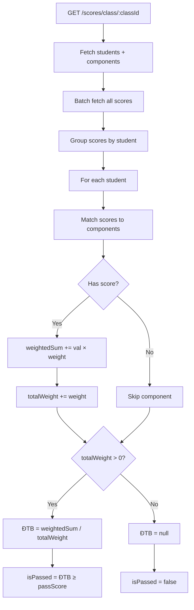

# Weighted Score Calculation

**Last updated:** 2026-04-09 · **Version:** 1.0

Calculates the per-subject average (ĐTB) using component weights as coefficients.

## Formula

```
ĐTB = Σ(score_i × weight_i) / Σ(weight_i for scored components only)
```

Only components **with an actual score** are included in the denominator. Missing scores are excluded.

## Worked Example

| Component | Score | Weight | Score × Weight |
|-----------|-------|--------|----------------|
| Miệng     | 8     | 10     | 80             |
| 15 phút   | 7     | 20     | 140            |
| 1 tiết    | 6     | 30     | 180            |
| Cuối kỳ   | 7     | 40     | 280            |
| **Total** |       | **100**| **680**        |

```
ĐTB = 680 / 100 = 6.8
```

### Partial Scores Example

If *1 tiết* has no score entered:

```
ĐTB = (80 + 140 + 280) / (10 + 20 + 40) = 500 / 70 = 7.14
```

## Implementation

```js
// backend/src/routes/score.routes.js
let weightedSum = 0, totalWeight = 0
for (const score of scores) {
  weightedSum += score.value * score.scoreComponent.weight
  totalWeight += score.scoreComponent.weight
}
const average = totalWeight > 0
  ? Math.round((weightedSum / totalWeight) * 100) / 100
  : null
```

Rounding: `Math.round(x * 100) / 100` → 2 decimal places.

## Calculation Flow



## Usage Points

| Endpoint | Context |
|----------|---------|
| `GET /scores/class/:classId` | Score sheet with per-student averages |
| `GET /scores/student/:studentId` | Student transcript with per-subject averages |
| `GET /reports/subject-summary` | Class-level pass rates per subject |
| `GET /reports/semester-summary` | Overall semester averages |

## Related

- [Score Components](./score-components.md)
- [Promotion Calculation](./promotion-calculation.md)
- [Source: score.routes.js](../../../backend/src/routes/score.routes.js)
- [Source: report.routes.js](../../../backend/src/routes/report.routes.js)
