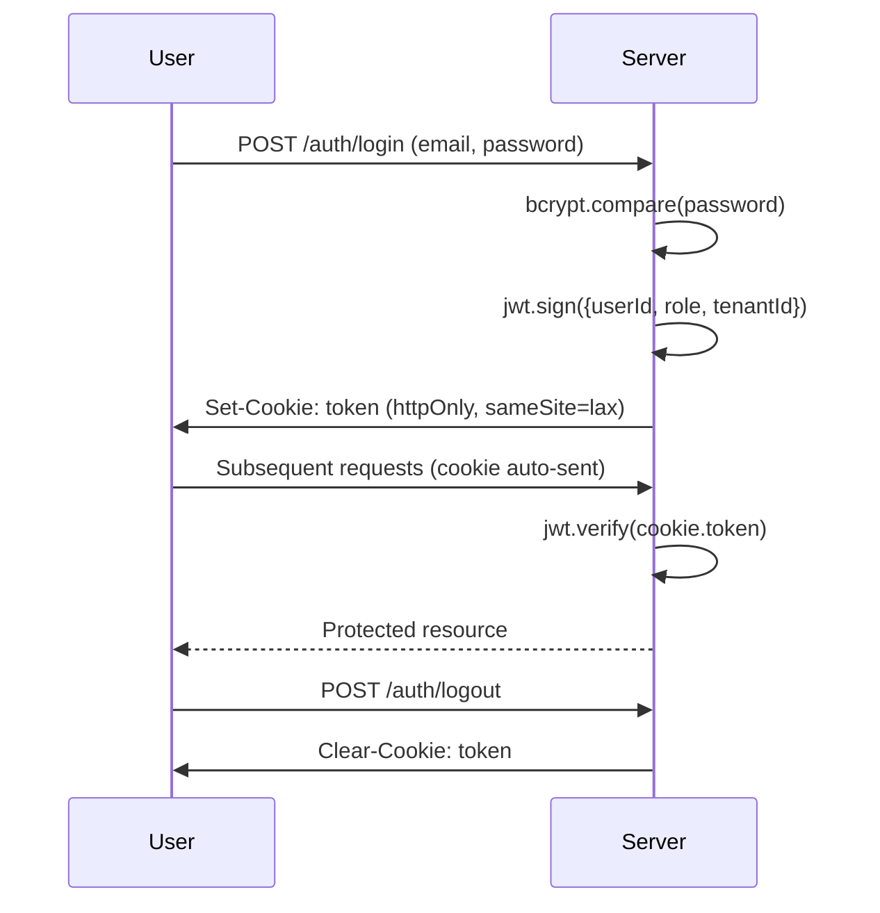

# Authentication Security

> JWT httpOnly cookies, bcrypt hashing, rate limiting.

## Password Hashing

```js
// backend/src/routes/auth.routes.js
import bcrypt from "bcryptjs";

const salt = await bcrypt.genSalt(10);        // async salt generation
const hash = await bcrypt.hash(password, salt); // 10 rounds
// Verification
const valid = await bcrypt.compare(input, storedHash);
```

## JWT Token Configuration

```js
// backend/src/middleware/auth.js
const token = jwt.sign({ userId, role, tenantId }, process.env.JWT_SECRET, {
  expiresIn: "24h",
});

res.cookie("token", token, {
  httpOnly: true,        // XSS protection (not accessible via JS)
  sameSite: "lax",       // CSRF mitigation
  secure: isProduction,  // HTTPS-only in production
  maxAge: 24 * 60 * 60 * 1000, // 24 hours
});
```

| Property | Value | Purpose |
|----------|-------|---------|
| `httpOnly` | `true` | Prevents XSS token theft |
| `sameSite` | `lax` | Mitigates CSRF attacks |
| `secure` | `true` (prod) | HTTPS-only transmission |
| `expiresIn` | `24h` | Token lifetime |
| Storage | Cookie (not localStorage) | No JS access |

## Authentication Flow



## Rate Limiting

```js
// backend/src/middleware/auth.js
const loginLimiter = rateLimit({
  windowMs: 15 * 60 * 1000,  // 15 minutes
  max: 50,                    // 50 attempts per window
  keyGenerator: (req) => req.ip,
});

const registerLimiter = rateLimit({
  windowMs: 60 * 60 * 1000,  // 1 hour
  max: 20,
});
```

| Endpoint | Limit | Window |
|----------|-------|--------|
| `POST /auth/login` | 50 | 15 min |
| `POST /auth/register` | 20 | 1 hr |

### Bypass Token (Automated Testing)

```js
if (req.headers["x-rate-limit-bypass"] === process.env.RATE_LIMIT_BYPASS_SECRET) {
  return next(); // Skip rate limiting for test suites
}
```

## Logout

```js
res.clearCookie("token"); // Server-side cookie removal
```

## Related

- [Tenant Isolation Security](./tenant-isolation.md)
- [Input Validation & Sanitization](./input-validation.md)
- `backend/src/routes/auth.routes.js`
- `backend/src/middleware/auth.js`
