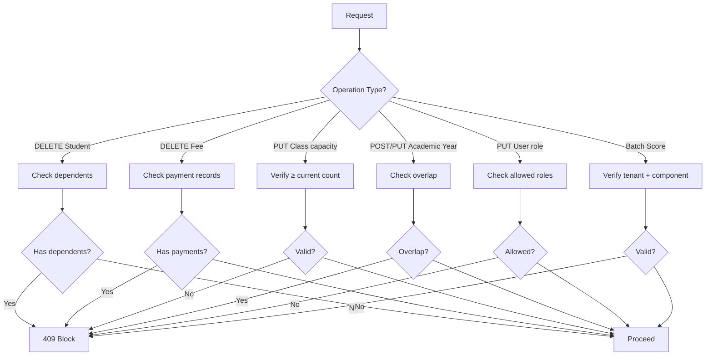

# Business Logic Protections

> Race condition prevention, delete guards, transaction wraps, cache invalidation.

## Race Condition Prevention

Serializable isolation for class capacity checks:

```js
await prisma.$transaction(async (tx) => {
  const count = await tx.student.count({ where: { classId } });
  const classInfo = await tx.class.findUnique({ where: { id: classId } });
  if (count >= classInfo.capacity) throw new ConflictError("Class full");
  return tx.enrollment.create({ data: { studentId, classId } });
}, { isolationLevel: "Serializable" });
```

## Delete Guards

| Entity | Guard Condition | Error |
|--------|----------------|-------|
| **Student** | Has promotions, fees, transfers, parent links, enrollments, or scores | `409 Conflict` |
| **Fee** | Has student payment records | `409 Conflict` |
| **Class capacity** | Cannot reduce below current student count | `400 Bad Request` |

## Score Protection

```js
// Score lock: block modification if locked
if (score.isLocked) throw new ForbiddenError("Score is locked");

// Batch score entry: validate component belongs to subject
const component = await prisma.scoreComponent.findUnique({
  where: { id: componentId, subjectId },
});
if (!component) throw new NotFoundError("Component not found for subject");
```

## Academic Year Overlap Check

```js
const overlap = await prisma.academicYear.findFirst({
  where: {
    tenantId: req.tenantId,
    OR: [
      { startDate: { lte: end }, endDate: { gte: start } },
    ],
  },
});
if (overlap) throw new ConflictError("Overlapping academic year");
```

## Role Escalation Prevention

```js
const allowedRoles = ["SUPER_ADMIN", "STAFF", "TEACHER"];
if (!allowedRoles.includes(newRole)) throw new ForbiddenError("Role escalation not allowed");
```

## Protection Flow



## Transaction-Wrapped Operations

| Operation | Reason |
|-----------|--------|
| Score batch create | Atomic score insertion |
| User assignments | Role + tenant consistency |
| Fee create | Fee + payment record atomicity |
| Promotion calculate | Year-end promotion consistency |

## Cache Invalidation

```js
await invalidateUserCache(userId); // On user disable/update/delete
```

## Edge Cases

| Scenario | Behavior |
|----------|----------|
| Max retention | Counts failures by academic year |
| Year-end promotion | Skipped students (missing grades) tracked and reported |
| Ranking | Returns `null` when student not found in classmate averages |

## Related

- [Input & Business Logic Validations](../business-rules/validations.md)
- [Tenant Isolation Security](./tenant-isolation.md)
- `backend/src/routes/*.routes.js`
