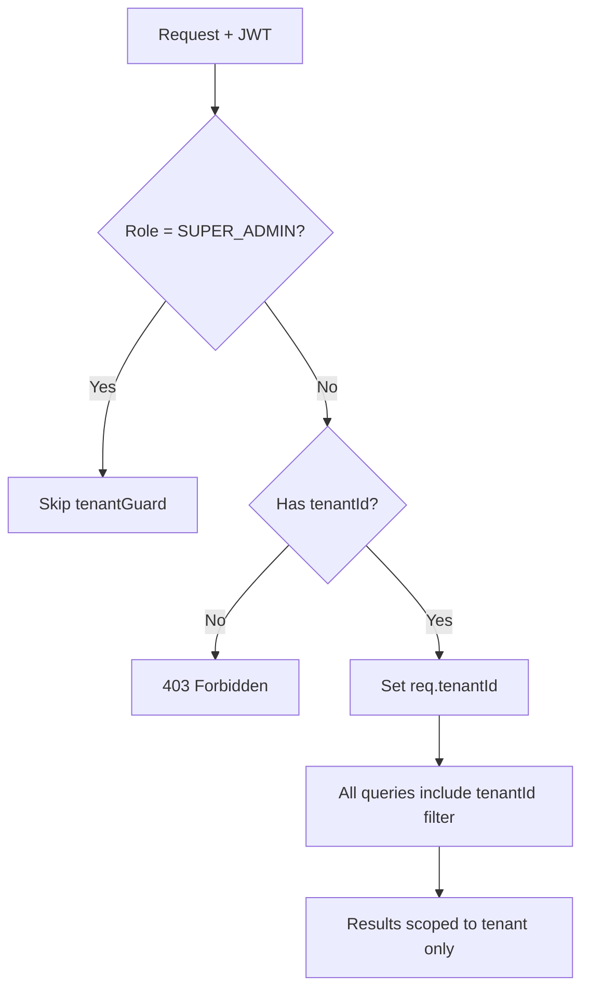

# Tenant Isolation Security

> Every query scoped by `tenantId`. Row-level security enforced at application layer.

## tenantGuard Middleware

```js
// backend/src/middleware/auth.js
export const tenantGuard = (req, res, next) => {
  if (req.user.role === "SUPER_ADMIN") return next(); // Platform admins access all
  if (!req.user.tenantId) {
    return res.status(403).json({ error: "No tenant context" });
  }
  req.tenantId = req.user.tenantId; // Inject tenantId into request
  next();
};
```

## Tenant ID Injection Pattern

Every query includes `tenantId` filter:

```js
// Students
const students = await prisma.student.findMany({
  where: { tenantId: req.tenantId, ...filters },
});

// Scores (double-scoped)
const scores = await prisma.score.findMany({
  where: { studentId, tenantId: req.tenantId },
});

// Teacher assignments
const assignments = await prisma.teacherAssignment.findMany({
  where: { classId, tenantId: req.tenantId },
});
```

## Isolation Flow



## Cross-Tenant Prevention

~40 fixes applied across all route files. Key areas:

| Area | Tenant Scoping |
|------|---------------|
| Student CRUD | `{ where: { tenantId } }` |
| Score CRUD | `{ where: { studentId, tenantId } }` |
| Class CRUD | `{ where: { tenantId } }` |
| Subject CRUD | `{ where: { tenantId } }` |
| Fee CRUD | `{ where: { tenantId } }` |
| Export routes | `tenantId` on all student/score/class/subject queries |

## Parent-Student Linking

```js
// Verify both parent and student belong to same tenant before linking
const student = await prisma.student.findUnique({
  where: { id: studentId, tenantId: req.tenantId },
});
if (!student) throw new NotFoundError("Student not found in your tenant");
```

## Batch Score Entry

```js
// Verify all students belong to tenant before processing
const students = await prisma.student.findMany({
  where: { id: { in: studentIds }, tenantId: req.tenantId },
});
if (students.length !== studentIds.length) {
  throw new ForbiddenError("Some students not in your tenant");
}
```

## Related

- [Authentication Security](./authentication-security.md)
- [Business Logic Protections](./business-logic-protections.md)
- `backend/src/middleware/auth.js`
- `backend/src/routes/*.routes.js`
